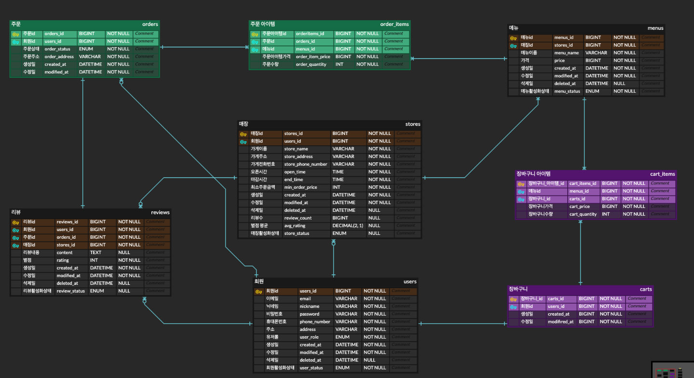

<div align="center">

<h1>I GO - Delivery</h1>


<br />


</div>

## 🛵 소개
- 배달 서비스 플랫폼 **"I GO - Delivery"** 입니다.
- **배민**, **쿠팡이츠**와 비슷한 기본 배달앱 API를 구현한 프로젝트입니다.
- 프론트 화면 없이 **백엔드 API 중심**으로 개발되었습니다.
- 핵심 기능을 담은 **REST API** 설계와 구현을 목표로 했습니다.


## 🗂️ 주요 기능
- 회원가입 및 로그인 (Filter - JWT 인증)
- 회원 CRUD
- 매장 CRUD
- 메뉴 CRUD
- 주문 CRUD
- 리뷰 CRUD
- 장바구니 CRUD

## 🛠️ 사용 기술 스택

### Back-end
<div>


</div>

### Tools
<div>


</div>

<br />

## 와이어 프레임
👉 [Figma 와이어 프레임 바로보기](https://www.figma.com/design/ZL6TyWFDhAcsGEaAEm7uel/Project---I-team?node-id=0-1&t=E8nJfBH3G7IBoYhj-1)

## ERD



## 🗂️ 프로젝트 아키텍처
```
src
└── main
└── java
└── com.delivery.igo.igo_delivery
├── api
│   ├── auth
│   ├── cart
│   ├── menu
│   ├── order
│   ├── review
│   ├── store
│   └── user
├── common
│   ├── annotation
│   ├── config
│   ├── dto
│   ├── entity
│   ├── exception
│   ├── filter
│   ├── util
│   └── validation
└── IgoDeliveryApplication.java
```

## 📑 API 명세서
- 작성한 API 목록은 아래 링크에서 확인할 수 있습니다.  
  👉 [Postman API 명세 바로보기](https://documenter.getpostman.com/view/43848380/2sB2j1hsBh)

